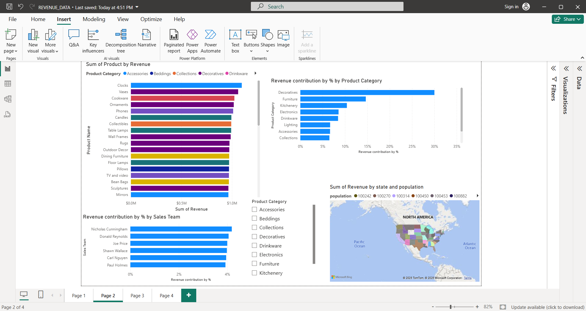

# 🛍️ TNNT Retail Sales Analysis (Capstone Project)

Welcome to the repository for my **Capstone Project** as the data analyst for **TNNT Retail**. This project showcases the end-to-end analysis of TNNT's sales data using **Power BI** and includes actionable insights visualized in an interactive dashboard.

---

## 📁 Dataset Overview

The analysis was performed on the following tables:

- `Orders Table`: Contains individual order-level data.
- `Products Table`: Contains details of each product sold.
- `Location Table`: Includes information about states, population, and median income.
- `Sales Team Table`: Holds data on different sales teams and their activities.

---

## 🧮 Project Tasks

As requested by the Sales Director, the following were carried out:

### 🔢 Calculated for Every Order:

- **Revenue**
- **Profit**

### 📊 Reports Created:

1. **Revenue Trend** over time
2. **Top Products by Revenue**
3. **Product Category Revenue Contribution (%)**
4. **Sales Team Revenue Performance**
5. **State-wise Revenue**, along with:
   - Population
   - Median Income

---

## 📊 Dashboard Features

- All reports are integrated into a single **Power BI Dashboard**.
- Dashboard is made **sliceable by Product Category** for dynamic exploration.

---

## 🧠 Key Insights

> The following were highlighted in a Power BI **textbox**:

1. **Top 2 Revenue-Generating Products** in **January**
2. **Sales Team with Most Revenue from the Decoratives** category in **March**
3. **Relationship Between Revenue, Population, and Median Income** of States

---

## 📷 Screenshot



> _Note: The dashboard screenshot above showcases the visualizations used in deriving insights._

---

## 🚀 Tools Used

- **Power BI** for data modeling, visualization, and dashboard development
- **Excel / CSV** for data cleaning and preparation
- **GitHub** for version control and portfolio presentation

---

## 📌 How to Use This Repo

1. Clone the repo:
   ```bash
   git clone https://github.com/SEUNspiration/TNNT_Data_Analysis.git
   cd tnnt-sales-analysis

  ---

 ## 🧑‍💼 Author
Ibe Ikechukwu
Data Analyst | Power BI Enthusiast | Portfolio: [https://github.com/SEUNspiration]
Feel free to reach out for feedback or collaboration.

## 📬 Contact
Email: ibeikechukwu.seun@gmail.com

LinkedIn: Ibe Ikechuwku Seun

GitHub: SEUNspiration
